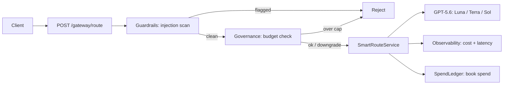

# SmartRoute — a GPT-5.6 tier router on Spring AI

[](https://github.com/vamsiduppala/smartroute/actions/workflows/ci.yml)

**Rides:** OpenAI **GPT-5.6** (Sol / Terra / Luna), launched **2026-07-09** → [launch coverage](https://techcrunch.com/2026/07/09/openai-launches-its-new-family-of-models-with-gpt-5-6/) · [OpenAI release notes](https://openai.com/products/release-notes/)

GPT-5.6 shipped as three tiers with a 5× price spread (Luna $1/$6 → Sol $5/$30 per Mtok). Reaching for Sol on every call is the expensive default. **SmartRoute classifies each request and sends it to the cheapest tier that still passes a check, escalating only on failure** — built with **Spring AI** so it drops into a Java/Spring stack.

```
prompt ──▶ ComplexityClassifier ──▶ start tier ──▶ call GPT-5.6 tier
                                                        │
                                        pass? ──yes──▶ return (answer + cost)
                                          │no
                                          ▼
                                     escalate one tier (Luna→Terra→Sol)
```

## Why Spring AI
GPT-5.6 is served on the OpenAI-compatible API, so the OpenAI starter targets the new model ids directly — no new SDK. The router overrides the model **per request**:

```java
var options = OpenAiChatOptions.builder().model(tier.modelId).build(); // gpt-5.6-luna / -terra / -sol
chatModel.call(new Prompt(prompt, options));
```

## Enterprise modules (AI Gateway)
SmartRoute is growing into an **AI Gateway** — a Spring Boot control plane in front of every LLM call. Each module rides a specific dated launch:

| Module | Endpoint | Rides | Status |
|--------|----------|-------|--------|
| **routing** (core) | `POST /route` | GPT-5.6 tiers (2026-07-09) | ✅ tested |
| **governance** | `GET/PUT /governance/*` | GPT-5.6 tier pricing | ✅ tested |
| **guardrails** | `POST /guardrails/*` | AI SDK 7 tool-drift defense (2026-07-09), Java port | ✅ tested |
| **observability** | `GET /observability/metrics` | AI SDK 7 telemetry redesign (2026-07-09) | ✅ tested |
| rag / memory / longcontext | — | Anthropic web-search / agent-memory / Sonnet 5 1M | ⏸ deferred — no Anthropic API credits available; RAG/long-context inherently need a live model call, so there's nothing honest to build API-free here |



68 tests across the modules, all green (CI on every push) — unit tests, `@WebMvcTest` web-layer slices per controller, and a full end-to-end test through the real embedded server. See `docs/*-NOTES.md` for per-module design.

## API docs
Swagger UI is at `/swagger-ui.html` (raw spec at `/v3/api-docs`) once the app is running — every endpoint below is documented and callable from there.

## Deploying
`Dockerfile` builds a multi-stage JRE image; `k8s/` has a Deployment (readiness/liveness wired to Actuator health groups) + Service + a `secret.example.yaml` template for `OPENAI_API_KEY`. Not deployed anywhere live — manifests are here for review, not a running cluster.

## Run it
Prerequisites: **Java 21** and **Maven 3.9+**.
```bash
export OPENAI_API_KEY=sk-...
mvn spring-boot:run                                      # Swagger UI at /swagger-ui.html

curl -s localhost:8080/route -H 'content-type: application/json' \
     -d '{"prompt":"What is the capital of France?"}'    # bare router → answered by Luna, fractions of a cent

curl -s localhost:8080/gateway/route -H 'content-type: application/json' \
     -d '{"tenant":"acme","prompt":"What is the capital of France?"}'   # full gateway: guardrails + budget + routing + spend booking

mvn spring-boot:run "-Dspring-boot.run.arguments=--eval --spring.main.web-application-type=none"  # benchmark → eval/results.md
```
(The benchmark needs an OpenAI key **with billing enabled** — a key without quota returns HTTP 429 `insufficient_quota`.)

## Benchmark
`eval/tasks.jsonl` holds a fixed task set spanning trivial → hard. The runner answers each **twice** — always-Sol baseline vs. routed — and writes `eval/results.md`.

> **Live numbers need an OpenAI key with billing** (a key without quota returns HTTP 429 `insufficient_quota`). For a **credit-free demonstration**, `RoutingSimulationTest` exercises the full routing + escalation path against a deterministic stub using the **real published GPT-5.6 pricing** and writes [`docs/simulation-results.md`](docs/simulation-results.md).
>
> **Simulated projection (NOT a live measurement):** on the sample task set, routing cut cost **~54.6%** vs. always-Sol at **5/5** equal pass rate. Live measurements would replace this once billing is available.

## Disclosure
Built with AI assistance (Claude). Model pricing/ids reflect the GPT-5.6 launch on 2026-07-09; verify against OpenAI's release notes before relying on them.

## License
MIT
